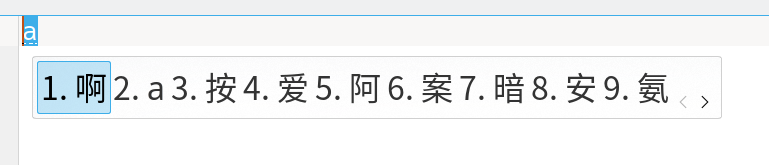
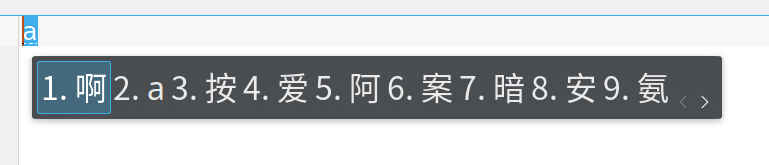
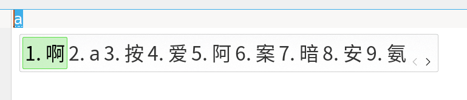
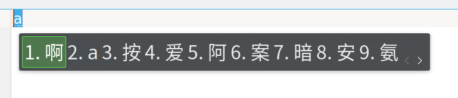
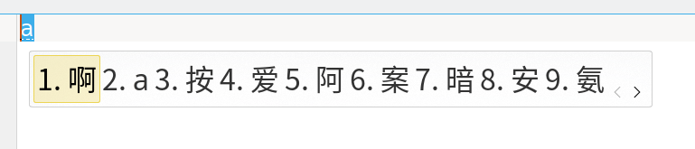
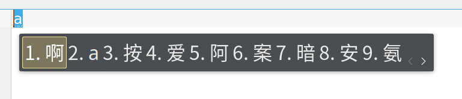

# fcitx5-plasma-themes

An set of themes looks like plasma style.

Contains blue, green, yellow, pink variants. Most of them have light and dark versions.

# Installation

## For Current User

Download latest release and extract it into `~/.local/share/fcitx5/themes/` directory, if it doesn't exist you need to mkdir first.

## For All Users

Download latest release and extract it into `/usr/share/fcitx5/themes/` directory, if it doesn't exist you need to mkdir first.

# Screenshots

## blue light

## blue dark

## green light

## green dark

## yellow light

## yellow dark

